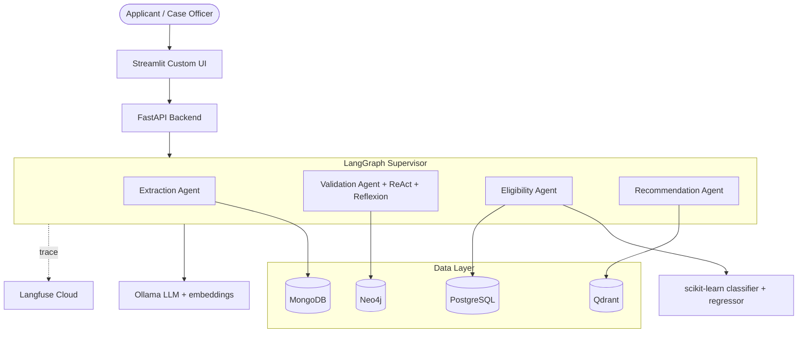

# Solution Summary - Social Support Application Workflow Automation

**Version:** 0.1.0 prototype  
**Date:** July 2026

---

## 1. Executive summary

This prototype automates the government social-support application workflow: multimodal document ingestion, cross-document validation, deterministic eligibility scoring via scikit-learn, and personalized economic-enablement recommendations via RAG - orchestrated by a LangGraph multi-agent pipeline with full Langfuse observability. The target is near-real-time decisions (minutes, not 5–20 days) while maintaining auditability and fairness.

---

## 2. Architecture diagram

### Data flow

1. Applicant submits form + documents via Streamlit.
2. FastAPI stores files and enqueues LangGraph processing (BackgroundTasks, non-blocking).
3. **Extraction Agent:** OCR (Tesseract) / PDF (pdfplumber) / Excel (pandas) → LLM JSON structuring → MongoDB.
4. **Validation Agent:** cross-checks address, income, names; builds household graph in Neo4j; bounded **ReAct tool loop** (read-only tools to verify flags) followed by a Reflexion self-critique on the officer summary.
5. **Eligibility Agent:** policy gates → scikit-learn score → LLM narrative (never decides eligibility).
6. **Recommendation Agent:** Qdrant RAG over enablement KB → LLM personalized program suggestions.
7. Decision persisted to PostgreSQL; UI polls status; Langfuse traces every LLM/agent step.

---

## 3. Tool choices and justification

| Tool | Role | Why chosen |
|------|------|------------|
| **Python + uv** | Language / packaging | Brief requirement; uv gives reproducible lockfiles and fast Docker builds. |
| **FastAPI** | Model serving | Async-capable, OpenAPI docs, production-grade; brief requirement. |
| **Streamlit** | Demo UI | Brief requirement; rapid custom-themed multi-page UI. |
| **LangGraph** | Agent orchestration | Explicit state machine - auditable routing for government decisions; best Langfuse integration among options. |
| **ReAct + Reflexion** | Reasoning | Validation agent runs a bounded ReAct loop with read-only tools (`list_detected_flags`, `get_extraction`, etc.); loop ends when the model returns no tool call. Reflexion then critiques the summary. Eligibility decisions remain ML-only. |
| **Ollama** | Local LLM hosting | Brief requirement; CPU-friendly prototype; swappable to vLLM via OpenAI-compatible client. |
| **scikit-learn** | Eligibility decision | Deterministic, auditable, feature-importance for bias control; brief requirement. |
| **PostgreSQL** | Structured state | Applications, decisions, audit log; Alembic migrations. |
| **MongoDB** | Document extractions | Flexible JSON for multimodal outputs. |
| **Qdrant** | Vector RAG | Enablement program knowledge base. |
| **Neo4j** | Household graph | Address/family relationships; duplicate detection. |
| **Langfuse** | Observability | End-to-end nested traces; brief requirement. |
| **Tesseract** | OCR | Lightweight CPU OCR for printed/scanned IDs. |
| **Alembic** | Migrations | Version-controlled Postgres schema. |
| **pytest** | Testing | Unit + API tests with mocked externals. |

### Suitability / scalability / maintainability / performance / security

- **Suitability:** Hybrid ML+LLM design separates decision (ML) from explanation (LLM), directly addressing bias and inconsistency pain points.
- **Scalability:** Prototype uses single-process BackgroundTasks + LLM semaphore; production path documented as Redis + Celery/Arq workers and vLLM serving.
- **Maintainability:** Layered backend (routes → services → repositories); separate uv projects per service; Alembic migrations.
- **Performance:** ML inference is milliseconds; bottleneck is CPU Ollama (serialized); acceptable for demo, upgrade path clear.
- **Security:** Secrets via `.env.dev`/`.env.prod` (gitignored); no credentials in images; PII handled as synthetic demo data only.

---

## 4. Modular workflow components

| Module | Location | Responsibility |
|--------|----------|----------------|
| Config | `backend/app/core/` | pydantic-settings, logging, exceptions |
| API | `backend/app/api/routes/` | REST endpoints |
| Services | `backend/app/services/` | Use-case orchestration |
| Repositories | `backend/app/repositories/` | Postgres data access |
| Extractors | `backend/app/extractors/` | OCR, PDF, Excel + LLM structuring |
| Agents | `backend/app/agents/` | LangGraph nodes + chat |
| ML runtime | `backend/app/ml/` | Feature assembly, rules, model loader |
| ML training | `ml/ssa_ml/` | Synthetic data + train scripts |
| Observability | `backend/app/observability/` | Langfuse callbacks |
| Frontend | `frontend/ssa_frontend/` | Streamlit UI |

---

## 5. Decision engine (who decides?)

**Layered hybrid:**

1. **Hard policy gates** (wealth ceiling, income per capita, missing documents) - can force soft-decline or needs-review. Only **Emirates ID** is required for auto-decide (`MIN_REQUIRED_DOCS = {"emirates_id"}`); other documents improve confidence.
2. **scikit-learn calibrated classifier** - owns approve/soft-decline probability and support-amount regressor.
3. **LLM** - explains the decision and generates enablement recommendations only; never computes eligibility.

This ensures consistency, determinism, and auditability while leveraging GenAI for language tasks.

---

## 6. Model card / data limitations

| Item | Detail |
|------|--------|
| **Training data** | Pure synthetic (12,000 applicants); rule-based labels + noise |
| **Classifier** | Calibrated HistGradientBoostingClassifier; ROC-AUC ~0.97 on held-out synthetic test |
| **Baseline** | LogisticRegression for interpretability comparison |
| **Regressor** | HistGradientBoostingRegressor for monthly support amount |
| **Limitation** | Synthetic labels ≠ real-world performance; requires validation on real (anonymized) data before production |
| **Handwriting** | Tesseract handles printed scans; handwriting needs TrOCR/cloud OCR in production |
| **Fairness** | Permutation importance exported; demographic features included for bias auditing |

---

## 7. Multimodal data-type mapping

| Document | Modality | Processor |
|----------|----------|-----------|
| Application form | Structured text | Postgres `form_data` |
| Emirates ID | Image | Tesseract OCR → LLM |
| Bank statement | PDF text + tables | pdfplumber → LLM |
| Resume | PDF text | pdfplumber → LLM |
| Assets/liabilities | Excel/tabular | pandas (deterministic) |
| Credit report | PDF text + tables | pdfplumber → LLM |

Storage: raw paths in Postgres/MongoDB; vectors in Qdrant; relationships in Neo4j.

---

## 8. API design

| Method | Path | Description |
|--------|------|-------------|
| POST | `/applications` | Create application |
| POST | `/applications/{id}/documents` | Upload document |
| POST | `/applications/{id}/process` | Start background processing |
| GET | `/applications/{id}` | Status + decision (poll) |
| GET | `/applications` | List applications |
| POST | `/chat` | Grounded chat |
| GET | `/health` | Liveness |
| GET | `/health/ready` | Dependency checks |

---

## 9. Future improvements

1. **MLOps:** model registry, drift monitoring, periodic retraining on real labeled data, human-in-the-loop feedback.
2. **Scaling:** Redis + Celery/Arq workers; vLLM/TGI for high-throughput LLM serving; horizontal FastAPI replicas.
3. **Integration:** SSO/OIDC auth, webhook notifications to case-management systems, REST API versioning.
4. **OCR:** TrOCR or cloud OCR for handwriting; optional vision LLM toggle.
5. **Security:** field-level encryption for PII, audit immutability, rate limiting, WAF.
6. **Data pipeline:** batch ingestion from legacy systems via Airflow/Composer; CDC from operational DBs.

---

## 10. Problem statement mapping

| Pain point | How addressed |
|------------|---------------|
| Manual data gathering | Automated OCR/PDF/Excel extraction + LLM structuring |
| Semi-automated validation | Validation Agent with cross-document checks + ReAct tool loop + Reflexion |
| Inconsistent information | Address/income/name reconciliation + Neo4j graph |
| Time-consuming reviews | End-to-end pipeline in minutes; officer dashboard for exceptions |
| Subjective decision-making | scikit-learn model + feature importance + policy gates |

---

*End of solution summary.*
